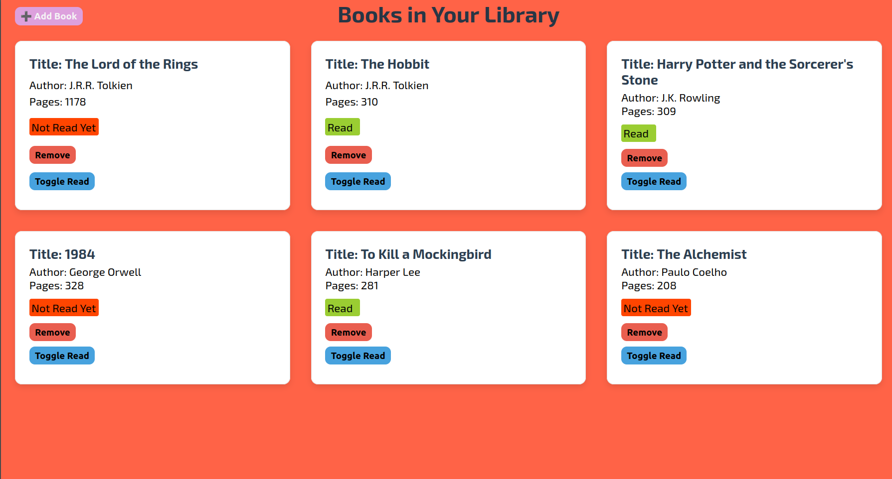
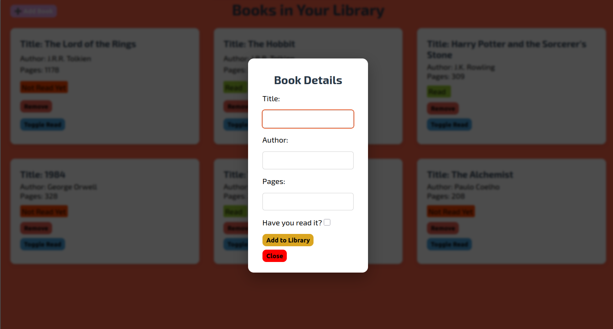

# Personal Library App - The Odin Project

This is a dynamic, client-side web application for managing a personal book collection. This project focuses on utilizing **JavaScript** to manage data (the library array) and dynamically update the **DOM**, alongside modern **CSS Grid** for the book card display and the **HTML `<dialog>`** element for the input form.

***

## Screenshot

## Live Demo

You can access it here: https://laym00n.github.io/odin-library/

## Features

* **Data Management:** All book data is stored and manipulated within a JavaScript array (`myLibrary`), demonstrating the separation of data from presentation.
* **Dynamic Rendering:** The `displayBooks()` function iterates over the library data and generates new book cards and buttons dynamically using the **DOM API**.
* **Object-Oriented Logic:** Uses a **`Book` constructor** and a prototype method (`toggleReadStatus`) for creating reusable and well-structured book objects.
* **Responsive Grid Display:** The book cards container utilizes **CSS Grid** (`repeat(auto-fit, minmax(300px, 1fr))`) to create a responsive, reflowing layout that adapts to different screen sizes.
* **Interactive Form:** Implements the native **HTML `<dialog>` element** for the "Add New Book" form, providing a clean, modal-style user input experience.
* **Status Indicators:** The read status is visually distinguished using specific color-coded CSS classes (`.status-read` and `.status-unread`).

---

## Technologies Used

1.  **HTML5:** Used for the basic structural elements, including the main sections, the button to open the form, and the modern **`<dialog>`** element.
    * **`FormData` API:** Used in JavaScript to easily collect input values from the submitted form.

2.  **CSS3:** Handled all application styling:
    * **CSS Grid & Flexbox:** Used for the responsive layout of the book cards and internal content alignment.
    * **Custom Fonts:** Integrated **Exo 2** and **Roboto** via Google Fonts.
    * **Visual Polish:** Includes **`box-shadow`** on the book cards and uses color transitions on buttons for a better user experience.

3.  **JavaScript:** The core logic engine:
    * **Constructor Functions and Prototypes:** Used for creating the `Book` objects and methods, emphasizing the classic JavaScript object pattern.
    * **Event Handling:** Manages form submission, dialog state (`showModal`, `close`), and the click events for the dynamically generated **Remove** and **Toggle Read** buttons.
    * **DOM Manipulation:** The `displayBooks` function handles all rendering by creating, styling, and appending elements to the `.book-cards` container.